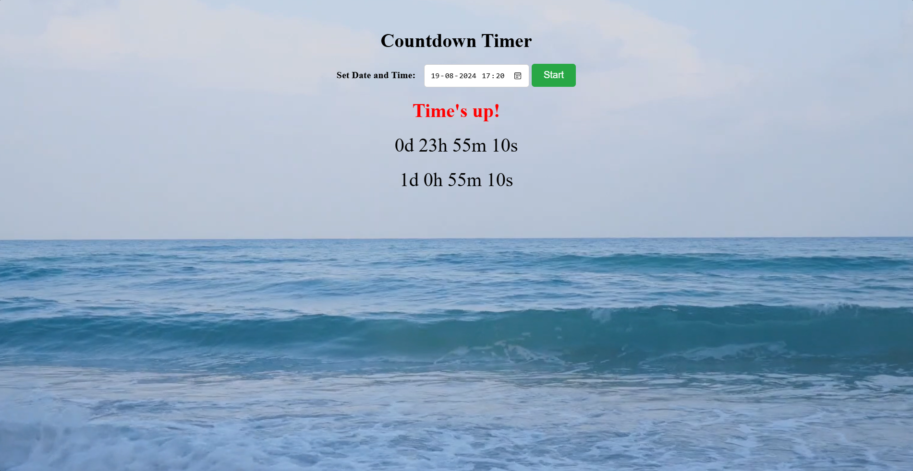

# Countdown-Timer Web Application

## Overview

This is a simple countdown timer web application built using HTML, CSS, and JavaScript. The application allows users to set a specific date and time in the future, and it will count down to that moment, displaying the remaining time in days, hours, minutes, and seconds. When the countdown reaches zero, a sound alarm will play to notify the user.

## Features

- **Set Countdown**: Users can input a specific date and time for the countdown.
- **Multiple Timers**: Users can set and display multiple countdown timers on the same page.
- **Real-time Updates**: The countdown timer updates in real-time using JavaScript's `setInterval()` function.
- **Alarm Sound**: An audio alarm plays when the countdown reaches zero.
- **Responsive Design**: The timer is styled with CSS and is responsive across different devices.
- **Customizable**: Easily modify the appearance and functionality of the timer using CSS and JavaScript.

## Demo

You can view a live demo of the countdown timer [https://skkyiee.github.io/Countdown-Timer/](#).

## Preview

## Getting Started

To get a local copy up and running, follow these steps.

### Prerequisites

- A modern web browser (e.g., Chrome, Firefox, Edge).
- Basic knowledge of HTML, CSS, and JavaScript.

### Installation

1. **Clone the Repository**:
    git clone https://github.com/skkyiee/countdown-timer.git

2. **Navigate to the Project Directory**:
    cd countdown-timer

3. **Open index.html in your browser**:
    Simply double-click the index.html file, or right-click and choose "Open with" followed by your preferred web browser.

## Usage
- Open the application in your web browser.
- Set a desired date and time using the input field.
- Click the "Start" button to initiate the countdown.
- The timer will display the remaining time in days, hours, minutes, and seconds.
- When the timer reaches zero, the alarm sound will play.

## Customization
- Change Alarm Sound: Replace the alarm.mp3 file in the project directory with your own audio file.
- Modify Timer Appearance: Edit the styles.css file to change the look and feel of the timer.
- Use a YouTube Video as Alarm: You can integrate a YouTube video as the alarm sound by following the instructions provided in the script.js comments.

# Conclusion
Thank you for checking out the Countdown Timer project. We hope you find it useful and easy to use. 
